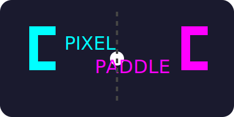

PixelPaddle is a twist on the classic Pong game, allowing players to design their own paddle shapes using a pixel grid. The paddle shape directly affects ball physics, making each match unique and strategic.

## Features

- **Custom Paddle Editor:** Draw your own paddle for each player using a 16x16 grid.
- **Preset Shapes:** Quickly select rectangle, diamond, cross, or circle paddles.
- **Color Customization:** Choose paddle colors for each player.
- **Game Settings:** Adjust ball speed, paddle scale, win score, AI difficulty, and more.
- **1P vs AI or 2P Mode:** Play against a smart AI or a second player.
- **Responsive Controls:** Player 1 uses WASD, Player 2 uses IJKL.
- **Dynamic Physics:** Ball responds to paddle shape and movement for advanced gameplay.

## How to Play

1. Open `PixelPaddle.html` in your browser.
2. Design paddles for both players using the grid editors.
3. Adjust game settings as desired.
4. Click "Start 1 Player" or "Start 2 Player" to begin.
5. Use keyboard controls to move paddles and compete to reach the target score.

## Project Structure

- `PixelPaddle.html` – Main HTML file (references external CSS/JS)
- `css/style.css` – All game styles
- `js/game.js` – Core game logic and functionality
- `js/ai.js` – AI player module with difficulty settings
- `img/logo.svg` – Game logo
- `README.md` – This documentation

## Setup

No installation required. Simply open the HTML file in any modern browser.

### For Developers

The AI logic was originally designed as a separate module. For active development with ES modules:

1. Use a local development server (e.g., `python -m http.server` or Live Server extension in VS Code)
2. Re-enable module imports in game.js and HTML script tag with `type="module"`
3. This allows for better code organization and modularity

## Credits

Created by Samuel Sledzieski. Powered by vanilla JavaScript and HTML5 Canvas.
